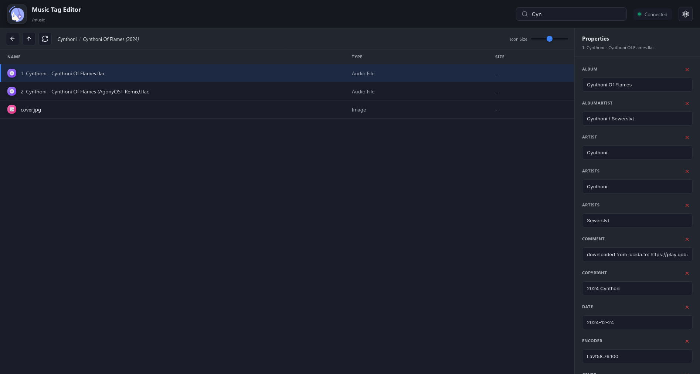
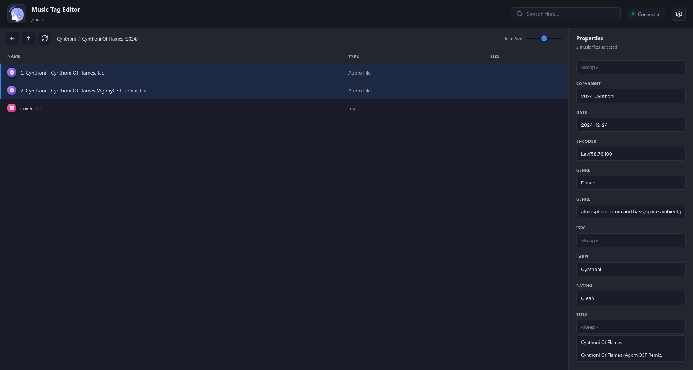
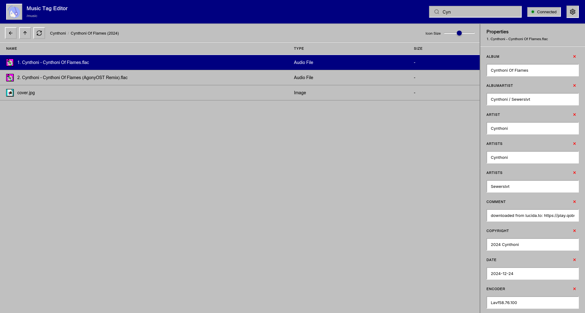
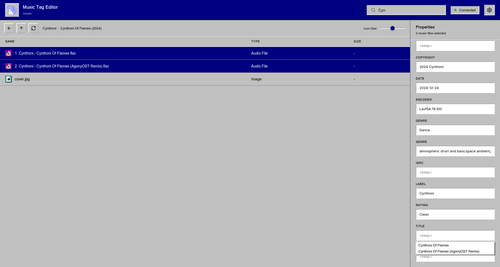

</a>

# Remote Tag Editor

WIP

# Features

WIP

- Edit multi-valued tags
- Easy to setup
- Upload files to remote server

# Building

```bash
git pull https://github.com/myooker/remote-tag-editor.git
cd remote-tag-editor
```

Specify the path to the music directory in `docker-compose.yml` before building:
```yaml
volumes:
  - /path/to/music:/music  # change this line
```

```bash
docker compose build
docker compose up -d
```

# About AI

Frontend is fully written by an AI. Please read [this page](frontend/README.md).

# Screenshots

**Modern Dark theme**



**Windows 95 theme**:

