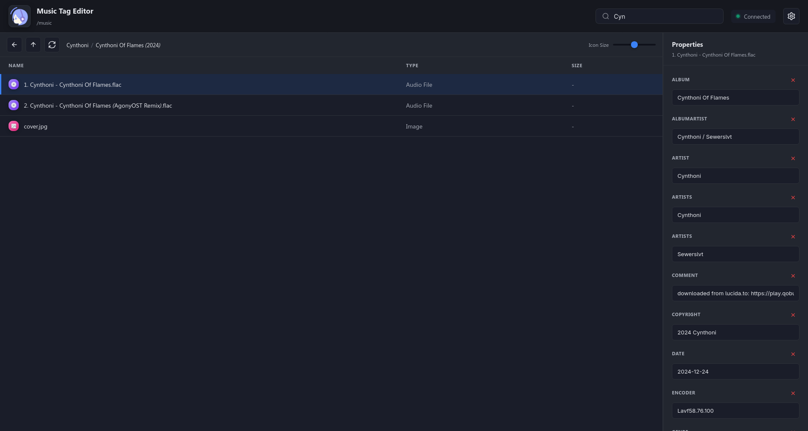
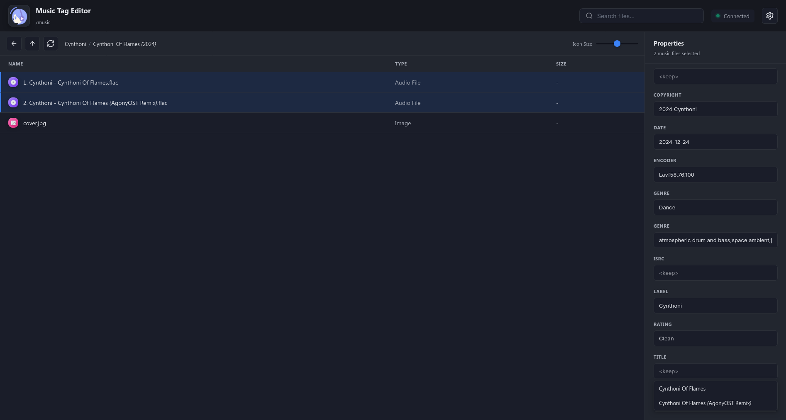

</a>
# Remote Tag Editor

Work in progress - not stable yet (especially change history), expect some funny bugs.

Remote Tag Editor is a self-hosted music metadata editor that you run with Docker and access from your browser. It supports tag normalization, multi-valued tag, and change history with undo.

# Features

- Multi-valued editing
- Change history
- Remote file upload
- Easy setup
- Browser-based

# Building

```bash
git pull https://github.com/myooker/remote-tag-editor.git
cd remote-tag-editor
```

Example `docker-compose.yml`:
```yaml
services:
  remote-tag-editor:
    build:
      context: .
      dockerfile: docker/Dockerfile
    ports:
      - "8080:80"
    volumes:
      - /path/to/music:/music
    restart: unless-stopped
```

```bash
docker compose build
docker compose up -d
```

The application should be accessible on `localhost:8080`.

# About AI

Frontend is fully written by an AI. Please read [this page](frontend/README.md).

# Screenshots




